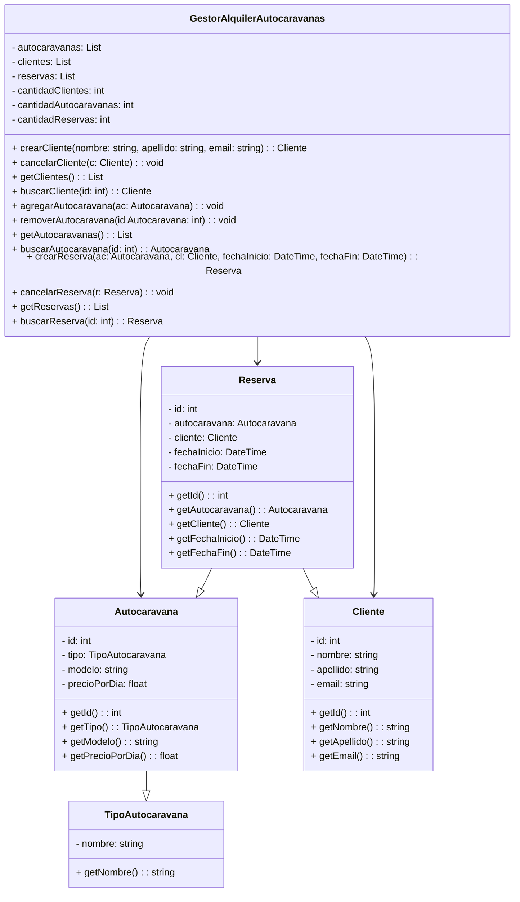
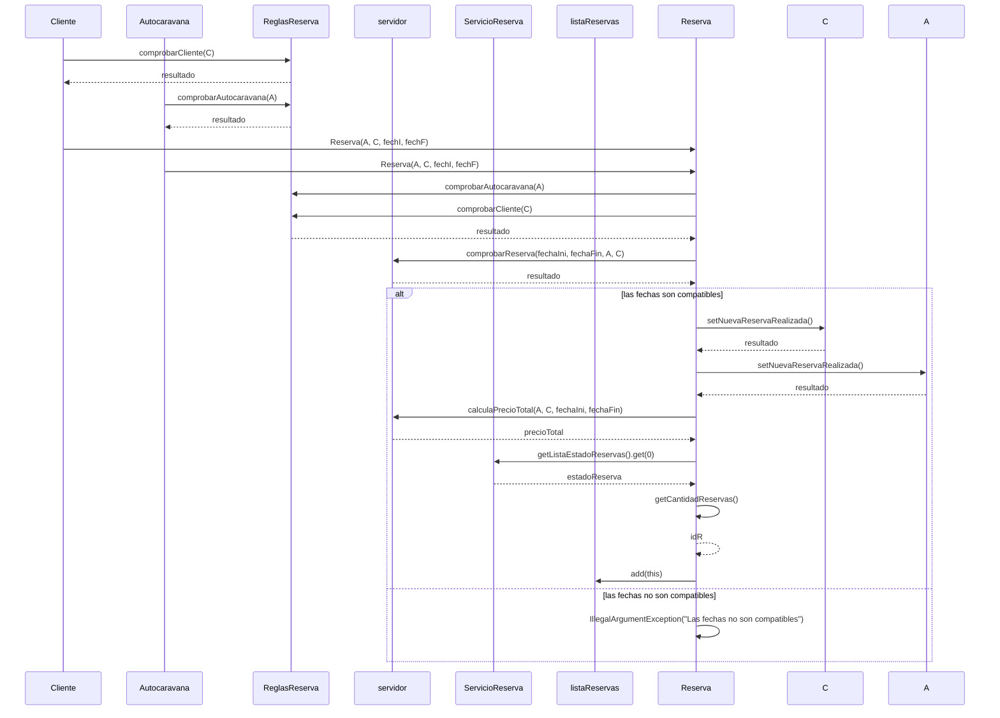

# dss2022--2023-MACFLG

# HITO 0
### El equipo está compuesto por Francisco López y Miriam Armario.
## Equipo
El equipo está compuesto por Francisco López y Miriam Armario.

## Herramientas
Para el sistema de control de versiones utilizaremos GitHub, y para el seguimiento del proyecto también utilizaremos GitHub, aprovechando la utilidad de su opción de Projects. Como IDE usaremos Visual Studio Code.

## Comunicación
La comunicación entre los miembros del equipo se realizará en su mayoría de forma presencial.

## Reuniones
Nos reuniremos semanalmente para revisar el avance del proyecto, con el objetivo de entregar cada hito antes de la fecha límite.

## Desarrollo
A medida que avancemos en los hitos, describiremos las herramientas que se vayan incorporando al proyecto.

# HITO 1
## Diagrama de secuencia

## Diagrama de Clases

```mermaid
classDiagram
    class Autocaravana {
        + servidor : ServicioAutocaravana
        - estado : String
        - idA : int
        - kilometraje : int
        - listaAutocaravanas : List<Autocaravana>
        - matricula : String
        - modelo : String
        - plazas : int
        - precioPorDia : float
        - vecesReservada : int
        + Autocaravana()
        + Autocaravana()
        + buscarAutocaravana()
        + eliminarAutocaravana()
        + getCantidadCaravanas()
        + getEstado()
        + getIdA()
        + getKilometraje()
        + getMatricula()
        + getModelo()
        + getPlazas()
        + getPrecioPorDia()
        + getVecesReservada()
        + quedanCaravanas()
        + setEstado()
        + setKilometraje()
        + setModelo()
        + setPrecioPorDia()
        + toString()
        ~ getListaAutocaravanas()
        ~ setNuevaReservaRealizada()
    }




    class AutocaravanaTest {
         + setUp()
        + test()
    }




    class Cliente {
        - apellido : String
        - dni : String
        - email : String
        - fechaNacimiento : LocalDate
        - idC : int
        - listaClientes : List<Cliente>
        - multas : int
        - nombre : String
        - reservasRealizadas : int
        - servidor : ServicioCliente
        - telefono : String
        + Cliente()
        + Cliente()
        + buscarCliente()
        + buscarCliente()
        + eliminarCliente()
        + getApellido()
        + getCantidadReservasRealizadas()
        + getDni()
        + getEdad()
        + getEmail()
        + getFechaNacimiento()
        + getIdC()
        + getMultas()
        + getNombre()
        + getNumeroClientes()
        + getTelefono()
        + setApellido()
        + setDni()
        + setEmail()
        + setFechaNacimiento()
        + setNombre()
        + setNuevaMulta()
        + setNuevaReservaRealizada()
        + setTelefono()
        + toString()
        ~ getListaClientes()
    }




    class ClienteTest {
        + setUp()
        + test()
    }


    class ReglasAutocaravana {
        + comprobarMatricula()
    }


    class ReglasCliente {
        + comprobarCliente()
        + comprobarDNI()
        + comprobarEdad()
    }




    class ReglasReserva {
        + listaEstadosReserva : List<String>
        + addEstadoReserva()
        + borrarEstado()
        + calculaPrecioTotal()
        + calcularMulta()
        + calcularTasaCancelacion()
        + calcularTasaFinalizacion()
        + calcularTasaModificacion()
        + comprobarAutocaravana()
        + comprobarCambioEstado()
        + comprobarCliente()
        + comprobarEstadoReserva()
        + comprobarReserva()
        + condicionesCancelacion()
        + condicionesFinalizacion()
        + condicionesModificacion()
        + eliminarEstadoReserva()
    }




    class RepositorioAutocaravana {
        + cargarAutocaravana()
        + cargarEstadosAutocaravana()
        + guardarAutocaravana()
        + guardarEstadoAutocaravana()
    }




    class RepositorioCliente {
        + cargarClientes()
        + cargarEstadosCliente()
        + guardarCliente()
        + guardarEstadosCliente()
    }




    class RepositorioReserva {
        + cargarEstadosReserva()
        + cargarReservas()
        + guardarEstadosReserva()
        + guardarReservas()
    }




    class Reserva {
        - cantidadReservas : int
        - estadoReserva : String
        - fechaFin : LocalDate
        - fechaIni : LocalDate
        - idR : int
        - listaReservas : List<Reserva>
        - precioTotal : float
        - servidor : ServicioReserva
        + Reserva()
        + Reserva()
        + buscarReserva()
        + buscarReserva()
        + checkIn()
        + checkOut()
        + eliminarReserva()
        + getAutocaravana()
        + getCantidadReservas()
        + getCliente()
        + getEstadoReserva()
        + getFechaFin()
        + getFechaIni()
        + getIdR()
        + getPrecioTotal()
        + setEstadoReserva()
        + toString()
        ~ getListaReservas()
        ~ setPrecioTotal()
    }




    class ReservaTest {
        + setUp()
        + test()
    }




    class ServicioAutocaravana {
        - AUTOCARAVANAS_FILE : String
        - ESTADOSAUTOCARAVANA_FILE : String
        - listaEstadosAutocaravana : List<String>
        + ServicioAutocaravana()
        + cargarAutocaravana()
        + cargarEstadosAutocaravana()
        + comprobarEstadoAutocaravana()
        + guardarAutocaravana()
        + guardarEstadoAutocaravana()
        ~ getListaEstadoAutocaravana()

  }



    class ServicioCliente {
        - CLIENTES_FILE : String
        - ESTADOSCLIENTE_FILE : String
        - listaEstadosCliente : List<String>
        + cargarClientes()
        + cargarEstadosCliente()
        + getListaEstadoClientes()
        + guardarCliente()
        + guardarEstadosCliente()
    }




    class ServicioReserva {
        - ESTADOSRESERVAS_FILE : String
        - RESERVAS_FILE : String
        - listaEstadoReserva : List<String>
        + cargarEstadosReserva()
        + cargarReservas()
        + checkIn()
        + checkOut()
        + comprobarEstadoReserva()
        + eliminarEstadoReserva()
        + getListaEstadoReservas()
        + guardarEstadosReserva()
        + guardarReservas()
        + nuevoestado()

        Autocaravana *-- ReglasAutocaravana
    }

    Autocaravana *--ReglasAutocaravana
    Reserva *--ReglasReserva
    Cliente *--ReglasCliente

    ServicioCliente .. ReglasCliente
    ServicioAutocaravana .. ReglasAutocaravana
    ServicioReserva .. ReglasReserva

    ServicioCliente .. RepositorioCliente
    ServicioReserva .. RepositorioReserva
    ServicioAutocaravana .. RepositorioAutocaravana

    Autocaravana -- RepositorioAutocaravana
    Cliente -- RepositorioCliente
    Reserva -- RepositorioReserva
```

- # MADR - Markdown Architectural Decision Record
## Cambios en el diseño del proyecto

En el diseño inicial del proyecto, como solo sabíamos C++ pensamos un diseño en el que el cliente pudiera implementar sus propias reglas de negocio a través de una lista de funciones. Sin embargo, en Java, se encontró que esta implementación no era adecuada en este lenguaje.

Al consultar con el profesor se llegó a la conclusión de que se debía utilizar el patrón de diseño **Strategy**  para lograr un mejor diseño.

En el nuevo diseño, se eliminó la lista de funciones para implementar reglas de negocio y se agregaron varias interfaces **ReglasReserva**, **ReglasAutocaravana**, **ReglasCliente** las cuales utiliza el **Patrón Strategy** para definir diferentes estrategias de negocio. Por consejo del profesor, también implemtamos unas interfaces para seguir el **Patrón Respository**. Se agregaron las clases **ServicioReserva**, **ServicioAutocaravana** y **ServicioCliente** que implementan las interfaces y definen los métodos. Estas tres últimas clases, son las que el Cliente tendría que implementar para definir las reglas de trabajo y el cómo se almacenan. 