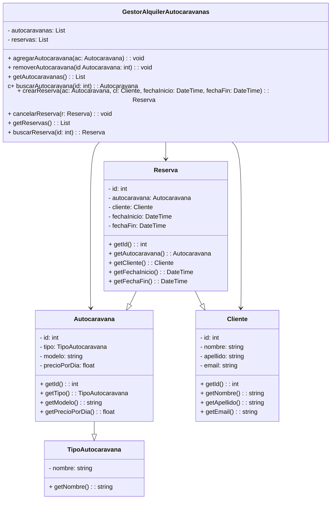

# dss2022--2023-MACFLG

### El equipo está compuesto por Francisco López y Miriam Armario.
## Equipo
El equipo está compuesto por Francisco López y Miriam Armario.

## Herramientas
Para el sistema de control de versiones utilizaremos GitHub, y para el seguimiento del proyecto también utilizaremos GitHub, aprovechando la utilidad de su opción de Projects. Como IDE usaremos Visual Studio Code.

## Comunicación
La comunicación entre los miembros del equipo se realizará en su mayoría de forma presencial.

## Reuniones
Nos reuniremos semanalmente para revisar el avance del proyecto, con el objetivo de entregar cada hito antes de la fecha límite.

## Desarrollo
A medida que avancemos en los hitos, describiremos las herramientas que se vayan incorporando al proyecto.

